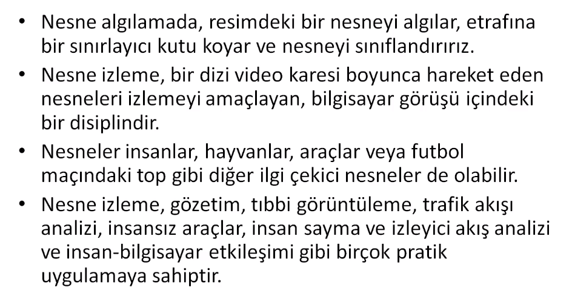

# Object Tracking with OpenCV

[Buraya tıklayarak Notion sayfamdan notlarımı inceleyebilirsiniz.](https://recepaydogdu.notion.site/Object-Tracking-with-OpenCV-49381c3a355548729d25a49c6b709f9b)

[Kullanılan kaynakları görüntülemek için tıklayınız.](kaynaklar.md)

## Object Tracking Nedir?




## Meanshift (Ortalama Kayma) Algoritması


### Meanshift Algoritma Uygulaması

Önce yüz tespit algoritması ile nesne tespiti yapacağız, sonrasında ise bulunan yüzü takip eden nesne takip algoritmasını yazacağız.

```python
import cv2
import numpy as np

#kamera ac
cap = cv2.VideoCapture(4)

# bir tane frame oku
ret, frame = cap.read()

if not ret:
    print("Frame okunamadi.")

# detection
face_cascade = cv2.CascadeClassifier("1_meanshift_camshift/haarcascade_frontalface_default.xml")
face_rects = face_cascade.detectMultiScale(frame)

(face_x, face_y, w, h) = tuple(face_rects[0])

# meanshift algoritma girdisi
track_window = (face_x, face_y, w, h)

# ROI (Region of Interest)
roi = frame[face_y : face_y + h, face_x : face_x + w] # roi = face

hsv_roi = cv2.cvtColor(roi, cv2.COLOR_BGR2HSV)
    
# takip icin histogram gerekli
roi_hist = cv2.calcHist([hsv_roi], [0], None, [180], [0, 180])
cv2.normalize(roi_hist, roi_hist, 0, 255, cv2.NORM_MINMAX)

# Takip icin gerekli durdurma kriterleri
# count = hesaplanacak max oge sayisi
# eps = yinelemeli algoritmanin durdugu parametrelerde istenen
term_crit = (cv2.TermCriteria_EPS | cv2.TermCriteria_COUNT, 5, 1)

while True:
    
    ret, frame = cap.read()
    
    if ret: 
        hsv = cv2.cvtColor(frame, cv2.COLOR_BGR2HSV)
        
        # Back projection
        dst = cv2.calcBackProject([hsv], [0], roi_hist, [0, 180], 1)
        # histogrami bir goruntude bulmak icin kullaniyoruz
        # boylece takip gerceklesiyor
        # piksel karsilastirma
        
        # Meanshift algoritmasi
        ret, track_window = cv2.meanShift(dst, track_window, term_crit)
        
        x, y, w, h = track_window
        
        img2 = cv2.rectangle(frame, (x, y), (x+w, y+h), (0,0,255), 5)
        
        cv2.imshow("Takip", img2)
        
        if cv2.waitKey(1) & 0xFF == ord("q"):
            break

cap.release()
cv2.destroyAllWindows()
```

Sonuç:

[meanshift.mp4](images/meanshift.mp4)

## Exploratory Data Analysis (Keşifsel Veri Analizi)

Bu bölümde diğer farklı takip algoritmalarının farklı veriler üzerinde nasıl çalıştığına bakacağız.

Yapacağımız adımları sırası ile aşağıdaki gibi olacak;

1. Veri setini indir
2. img2video
3. EDA → Ground Truth

### Veri Seti

Multiple Object Tracking Benchmark verisetlerini kullanacağız.

[MOT Challenge - Data](https://motchallenge.net/data/MOT17/)

MOT17.zip dosyasını indirdik ve ihtiyacımız olan MOT17-13-SDP isimli videonun verilerini aldık.

### Image2Video

Edindiğimiz video verilerini birleştirerek 25 FPS video’ya dönüştürelim;

```python
from importlib.resources import path
import cv2
import os
from os.path import isfile, join
import matplotlib.pyplot as plt
import tqdm

pathIn = r"2_exploratory_data_analysis/img1"
pathOut = "2_exploratory_data_analysis/deneme.mp4"

files = [f for f in os.listdir(pathIn) if isfile(join(pathIn, f))]

# img = cv2.imread(join(pathIn,files[44]))

# img_rgb = cv2.cvtColor(img, cv2.COLOR_BGR2RGB)

# plt.figure(), plt.imshow(img_rgb), plt.show()

fps = 25
size = (1920, 1080)
out = cv2.VideoWriter(pathOut, cv2.VideoWriter_fourcc(*"MP4V"), fps, size, True)

for i in tqdm.tqdm(files):
    print(i)
    
    filename = pathIn + "/" + i
    img = cv2.imread(filename)
    out.write(img)
```

 

### Grount Truth’ların İncelenmesi

`gt.txt` dosyasının içinde aşağıdaki gibi her frame’e ait bilgiler yer almakta.


Bu bilgilerin anlamları;


Konu ile ilgili makale: 

[](https://arxiv.org/pdf/1603.00831.pdf)

```python
import pandas as pd
import cv2
import numpy as np
import matplotlib.pyplot as plt
import time
import seaborn as sns

col_list = ["frame_number", "identity_number", "left", "top", "width", "height", "score", 
            "class", "visibility"]

data = pd.read_csv("gt.txt", names = col_list)

# plt.figure()
# sns.countplot(data["class"])

# data'nin icinden class'i 3 olanlar arabalari belirtir.
car = data[data["class"] == 3]

video_path = "MOT17_13_SDP.mp4"

cap = cv2.VideoCapture(video_path)

# Videoda 29 numarali araci takip edecegiz.;

id1 = 29
numberOfImage = np.max(data["frame_number"])
fps = 25
bound_box_list = []

for i in range(numberOfImage - 1):
    ret, frame = cap.read()
    
    if ret:
        frame = cv2.resize(frame, dsize = (960, 540))
        
        filter_id1 = np.logical_and(car["frame_number"] == i+1, car["identity_number"] == id1)
        
        if len(car[filter_id1]) != 0:
            
            x = int(car[filter_id1].left.values[0]/2)
            y = int(car[filter_id1].top.values[0]/2)
            w = int(car[filter_id1].width.values[0]/2)
            h = int(car[filter_id1].height.values[0]/2)
            
            cv2.rectangle(frame, (x, y), (x + w, y + h), (0, 255, 0), 2)
            cv2.circle(frame, (int(x+w/2), int(y+h/2)), 2, (0,0,255), -1)
            
            # frame, x, y, genislik, yukseklik, center_x, center_y
            bound_box_list.append([i, x, y, w, h, int(x+w/2), int(y+h/2)])
            
        cv2.putText(frame, "Frame num: " + str(i+1), (10, 30), cv2.FONT_HERSHEY_SCRIPT_SIMPLEX, 1, (0, 0, 255), 2)
        cv2.imshow("frame", frame)
        
        if cv2.waitKey(1) & 0xff == ord("q"):
            break
    else:
        break
    
cap.release()
cv2.destroyAllWindows()

# Yukarida olusturdugumuz ground truth'a ait df olusturup kaydedelim.
df = pd.DataFrame(bound_box_list, columns = ["frame_no", "x", "y", "w", "h", "center_x", "center_y"])
df.to_csv("gt_new.txt", index = False)

print("\nend...")
```


Ground Truth’unu bildiğimiz nesneyi bir sonraki derste takip edeceğiz.

## Takip Algoritmaları

**Sıklıkla kullanılan takip algoritmaları şunlardır;**

- **BOOSTING Takip Algoritması**
- **TLD (Tracking, Learning, and Detection) Takip Algoritması**
- **MEDIANFLOW Takip Algoritması**
- **MOSSE (Minimum Output Sum of Squared Error) Takip Algoritması**
- **CSRT Takip Algoritması**
- **KCF (Kernelized Correlation Filters) Takip Algoritması**
- **MIL (Multiple Instance Learning) Takip Algoritması**

### BOOSTING Takip Algoritması

- Decision Tree’lerden oluşan AdaBoost’un (adaptif boosting makine öğrenmesi algoritması) çevrimiçi bir sürümüne dayanmaktadır.
- Bu sınıflandırıcı, nesnenin olumlu ve olumsuz örnekleriyle çalışma zamanında eğitilmelidir.
- Kullanıcı (veya başka bir nesne algılama algoritması tarafından) tarafından sağlanan ilk sınırlayıcı kutu, nesne için olumlu bir örnek olarak alınır ve sınırlayıcı kutunun dışındaki birçok görüntü yaması arka plan olarak kabul edilir.
- Yeni bir çerçeve verildiğinde, sınıflandırıcı, önceki konumun çevresindeki her piksel üzerinde çalıştırılır ve sınıflandırıcının puanı kaydedilir.
- Nesnenin yeni konumu, puanın maksimum olduğu yerdir.

Yukarıdaki algoritmalar arasındaki en zayıf algoritma BOOSTING algoritmasıdır.

### Uygulama

```python
import cv2
import numpy as np
import matplotlib.pyplot as plt
import time
import pandas as pd

OPENCV_OBJECT_TRACKERS = {"csrt"      : cv2.legacy.TrackerCSRT_create(),
		                  "kcf"       : cv2.legacy.TrackerKCF_create(),
		                  "boosting"  : cv2.legacy.TrackerBoosting_create(),
		                  "mil"       : cv2.legacy.TrackerMIL_create(),
		                  "tld"       : cv2.legacy.TrackerTLD_create(),
		                  "medianflow": cv2.legacy.TrackerMedianFlow_create(),
		                  "mosse"     : cv2.legacy.TrackerMOSSE_create()}

tracker_name = "kcf"
print("Tracker:", tracker_name)

tracker = OPENCV_OBJECT_TRACKERS[tracker_name]

# Ground truth'u yukle;

gt = pd.read_csv("gt_new.txt")

# Videoyu ice aktar;

video_path = "MOT17_13_SDP.mp4"
cap = cv2.VideoCapture(video_path)

# Genel Parametreler

initBB = None # Secilen nesnenin bounding box bilgisi depolanacak
fps = 25
frame_number = []
f = 0
success_frame_track = 0
track_list = []
start_time = time.time()

while True:
    ret, frame = cap.read()
    
    # okunan videoyu yavaslatmak icin;
    time.sleep(1/fps)
    
    if ret:
        frame = cv2.resize(frame, (960, 540))
        (H, W) = frame.shape[:2]
        
        # ground truth
        car_gt = gt[gt.frame_no == f]
        
        if len(car_gt) != 0:
            
            # 0. frame'de bir nesne sececegiz, secilen nesneyi boosting takip edecek.
            # Secilen nesnenin konum bilgileri;
            x = car_gt.x.values[0]
            y = car_gt.y.values[0]
            h = car_gt.h.values[0]
            w = car_gt.w.values[0]
            center_x = car_gt.center_x.values[0]
            center_y = car_gt.center_y.values[0]
            
            cv2.rectangle(frame, (x,y), (x+w, y+h), (0,255,0), 2)
            cv2.circle(frame, (center_x, center_y), 2, (0,0,255), -1)
            
        # Gorsellestirme
        key = cv2.waitKey(1) & 0xFF
        
        # Tracking sonucunun uretilmesi;
        if initBB is not None:
            
            (success, box) = tracker.update(frame)
            
            # Basari metrigini belirlemek icin gt'nin frame icinde olmasi gerekiyor.
            # Bunu kontrol edebilmek icin if kosulu;
            if f <= np.max(gt.frame_no):
            
                (x, y, w, h) = [int(i) for i in box]
                
                cv2.rectangle(frame, (x,y), (x+w, y+h), (0,0,255), 2)
                
                success_frame_track = success_frame_track + 1
                
                track_center_x = int(x+w/2)
                track_center_y = int(y+h/2)
                
                # ground truth ile tracking sonucunu karsilastirabilmek icin;
                track_list.append([f, track_center_x, track_center_y])
        
            # Tracking sonuclarini gorsellestirme;
            info = [("Tracker:", tracker_name),
                    ("Success:", "Yes" if success else "No")]
            
            for (i, (o,p)) in enumerate(info):
                text = "{}: {}".format(o, p)
                cv2.putText(frame, text, (10, H-(i*20)-30), cv2.FONT_HERSHEY_SIMPLEX, 0.6, (0,0,255), 2)
                
        cv2.putText(frame, "Frame num: "+str(f), (10, 20), cv2.FONT_HERSHEY_SIMPLEX, 0.6, (0,0,255), 2)
        cv2.imshow("BoostingAlgorithm", frame)
        
        if key == ord("t"):
            # Takip etmek istenilen bolgenin secilmesi;
            # t tusuna basildiginda secim ekrani acilir, secimden sonra space tusuna basinca program devam eder.
            initBB = cv2.selectROI("SelectROI", frame, fromCenter = False)
            
            tracker.init(frame, initBB)
            
        elif key == ord("q"): break # quit
        
        # frame parametreleri
        frame_number.append(f)
        f = f + 1
        
    else:
        print("Video dosyasi okunamiyor ya da video bitti...")
        break
    
cap.release()
cv2.destroyAllWindows()

# Model degerlendirmesi
stop_time = time.time()
time_diff = stop_time - start_time

track_df = pd.DataFrame(track_list, columns=["frame_no", "center_x", "center_y"])

if len(track_df) != 0:
    print("Tracking Algorithm:", tracker)
    print("Time:", time_diff)
    print("Number of frame to track (gt):", len(gt))
    print("Number of frame to track (track success):", success_frame_track)
    
    track_df_frame = track_df.frame_no
    
    gt_center_x = gt.center_x[track_df_frame].values
    gt_center_y = gt.center_y[track_df_frame].values

    track_df_center_x = track_df.center_x.values
    track_df_center_y = track_df.center_y.values
    
    plt.plot(np.sqrt((gt_center_x-track_df_center_x)**2 + (gt_center_y-track_df_center_y)**2))
    plt.xlabel("frame")
    plt.ylabel("Euclidian Distance btw gt and track")
    error = np.sum((gt_center_x-track_df_center_x)**2 + (gt_center_y-track_df_center_y)**2)
    print("Total error:", error)
```

Algoritmanın çalışma sonucu:

Kırmızı kutu tracking algoritmasının sonucunu, yeşil kutu ise ground truth’u göstermektedir;

[kcf_result.mp4](https://drive.google.com/file/d/1TVdpDlVnse_N-2KXYFyYK1O_0URa_KvC/view?usp=drivesdk)

### Algoritmaların Karşılaştırmaları

**Boosting**

Tracking Algorithm: <legacy_TrackerBoosting 0x7f5fac95c2f0>
Time: 17.53201675415039
Number of frame to track (gt): 451
Number of frame to track (track success): 401
Total error: 52511


**CSRT**

Tracking Algorithm: <legacy_TrackerCSRT 0x7f5f59060a30>
Time: 18.26183319091797
Number of frame to track (gt): 451
Number of frame to track (track success): 385
Total error: 2587


**KCF**

Tracking Algorithm: <legacy_TrackerKCF 0x7f5fac0c8f50>
Time: 11.496551275253296
Number of frame to track (gt): 451
Number of frame to track (track success): 405
Total error: 1748745


**MIL**

Tracking Algorithm: <legacy_TrackerMIL 0x7f5f52848cd0>
Time: 30.98068118095398
Number of frame to track (gt): 451
Number of frame to track (track success): 402
Total error: 156456


**TLD**

Tracking Algorithm: <legacy_TrackerTLD 0x7f5fac0d2190>
Time: 37.87285590171814
Number of frame to track (gt): 451
Number of frame to track (track success): 411
Total error: 2589842


**MedianFlow**

Tracking Algorithm: <legacy_TrackerMedianFlow 0x7f5f528287f0>
Time: 9.296082258224487
Number of frame to track (gt): 451
Number of frame to track (track success): 414
Total error: 959965


**Mosse**

Tracking Algorithm: <legacy_TrackerMOSSE 0x7f5f528c8570>
Time: 8.59143877029419
Number of frame to track (gt): 451
Number of frame to track (track success): 412
Total error: 2000631


## Multi Object Tracking

```python
import cv2

OPENCV_OBJECT_TRACKERS = {"csrt"      : cv2.TrackerCSRT_create,
		                  "kcf"       : cv2.TrackerKCF_create,
		                  "boosting"  : cv2.TrackerBoosting_create,
		                  "mil"       : cv2.TrackerMIL_create,
		                  "tld"       : cv2.TrackerTLD_create,
		                  "medianflow": cv2.TrackerMedianFlow_create,
		                  "mosse"     : cv2.TrackerMOSSE_create}

tracker_name = "medianflow"

trackers = cv2.MultiTracker_create()

video_path = "MOT17-04-DPM.mp4"
cap = cv2.VideoCapture(video_path)

fps = 30     
f = 0
while True:
    
    ret, frame = cap.read()
    (H, W) = frame.shape[:2]
    frame = cv2.resize(frame, dsize = (960, 540))
    
    (success , boxes) = trackers.update(frame)
    
    info = [("Tracker", tracker_name),
        	("Success", "Yes" if success else "No")]
    
    string_text = ""
    
    for (i, (k, v)) in enumerate(info):
        text = "{}: {}".format(k, v)
        string_text = string_text + text + " "
    
    cv2.putText(frame, string_text, (10, 20),cv2.FONT_HERSHEY_SIMPLEX, 0.6, (0, 0, 255), 2)
    
    for box in boxes:
        (x, y, w, h) = [int(v) for v in box]
        cv2.rectangle(frame, (x, y), (x + w, y + h), (0, 255, 0), 2)
    
    cv2.imshow("Frame", frame)
    key = cv2.waitKey(1) & 0xFF
    
    if key == ord("t"):
        
        box = cv2.selectROI("Frame", frame, fromCenter=False)
    
        tracker = OPENCV_OBJECT_TRACKERS[tracker_name]()
        trackers.add(tracker, frame, box)
    elif key == ord("q"):break

    f = f + 1
    
cap.release()
cv2.destroyAllWindows()
```
